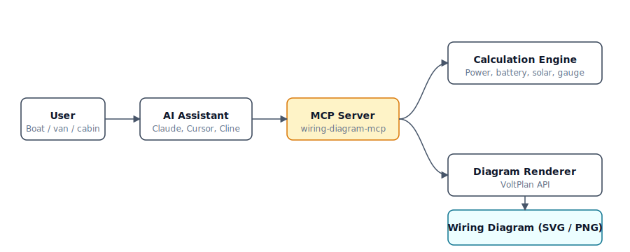

# VoltPlan Wiring Diagrams · MCP Server

> **I refit my boat with Claude as the electrician. Here's the MCP that made it possible.**

An [MCP](https://modelcontextprotocol.io/) server that gives Claude (or any MCP-compatible AI) domain expertise in 12V / 24V / 48V electrical systems — sizing the bank, picking the wire gauge, recommending the fuse, and generating a complete wiring diagram. For boats, campers, vans, and off-grid builds.

[](LICENSE)
[](https://www.npmjs.com/package/wiring-diagram-mcp)
[](https://modelcontextprotocol.io/)
[](https://mcp.voltplan.app/mcp)

```json
{ "mcpServers": { "wiring-diagram": { "url": "https://mcp.voltplan.app/mcp" } } }
```

Drop that into your `claude_desktop_config.json`, restart Claude, ask: *"Plan a 400 Ah lithium house bank for a 30 ft sailboat with 2 days of autonomy."* Done.

---

## Why this exists

Built while refitting *Largo*, a 1996 Maxum, in Roermond. The math kept getting in the way of the work — sizing the bank, then the gauge, then the fuse, then redoing all of it after one load changed. So I gave Claude the math. Now it sizes the bank, picks the gauge, and generates the diagram. I'd rather just do the cabling.

The calculations are the same ones any cruiser or vanlifer ends up doing on graph paper at 11pm. This server makes them a one-sentence prompt.

## What it does

Nine tools, all callable by name from any MCP client:

| Tool | What it does |
|---|---|
| `calculate_power_budget` | Daily energy draw from a list of loads (Wh, Ah, peak power) |
| `calculate_battery_bank` | Bank size for given consumption + autonomy + DoD |
| `calculate_battery_config` | Series/parallel arrangement to hit a target voltage and capacity |
| `calculate_solar_size` | Panel wattage to recharge daily, accounting for sun hours and losses |
| `calculate_wire_gauge` | AWG / mm² for current and run length, with fuse recommendation |
| `calculate_inverter_size` | Inverter wattage for AC loads, with surge headroom and DC current draw |
| `calculate_charging_time` | Time from X% to Y% SoC, with bulk and absorption phases |
| `generate_wiring_diagram` | Complete schematic as SVG or PNG, auto-fused and protected |
| `list_component_types` | Component reference and example configs for diagram building |

## Demo

Three real prompts, three real outputs.

### 1. Size a sailboat house bank

> *"Plan a 400 Ah lithium house bank for a 30 ft sailboat. Loads: 12V fridge 24/7 (60W), LED nav and cabin lights (25W, 4h/day), USB chargers (30W, 2h/day), occasional inverter for a laptop (90W, 3h/day). 2 days of autonomy without solar, LiFePO4 with 80% DoD."*

Claude calls `calculate_power_budget` then `calculate_battery_bank`:

```
Total daily energy: 1,870 Wh/day  (155.8 Ah/day at 12V)
Peak load:           205 W        (17.1 A)

Required capacity (2 days × 80% DoD):  4,675 Wh / 389.6 Ah
Recommended bank: 4 × 100 Ah / 12.8 V LiFePO4 in parallel (4P)
Total / usable:   400 Ah / 5,120 Wh   →   4,096 Wh usable
                  ≈ 2.2 days of autonomy
```

### 2. Pick a gauge for an inverter run

> *"What gauge wire for a 50A inverter run, 3 meters one-way, 12V, marine environment, max 3% drop?"*

Claude calls `calculate_wire_gauge`:

```
Recommended cable:    16 mm² (6 AWG)   — rated 65 A
Voltage drop:         0.34 V (2.80%)   ✓ within target
Total resistance:     6.7 mΩ
Power lost as heat:   16.8 W
Fuse:                 70 A ANL bolt-down, within 18 cm of battery+

Status: OK — wire size meets all requirements.
```

(Ampacity alone would allow 10 mm² / 8 AWG, but voltage drop drives the choice up at this length.)

### 3. Generate a full schematic

> *"Generate a wiring diagram for: 2 × 100W solar → MPPT → 200 Ah LiFePO4 → BMV-712 monitor → main 12V bus → fridge, lights, USB."*

Claude calls `generate_wiring_diagram` and returns an SVG: batteries with terminals, MPPT charger, auto-generated shunt, main switch, low-voltage cutoff, and fused load lines in red/black with computed gauges.

See [`examples/`](./examples) for five fully-worked scenarios — sailboat refit, Sprinter van, off-grid cabin, day sailer, live-aboard — each with the prompt, the expected tool calls, and the resulting numbers.

## 5-minute setup

### Claude Desktop (hosted — easiest)

Edit `claude_desktop_config.json` (Settings → Developer → Edit Config):

```json
{
  "mcpServers": {
    "wiring-diagram": {
      "url": "https://mcp.voltplan.app/mcp"
    }
  }
}
```

Restart Claude. The hammer icon in the chat input means tools are active.

### Claude Desktop (local via npx)

```json
{
  "mcpServers": {
    "wiring-diagram": {
      "command": "npx",
      "args": ["wiring-diagram-mcp"]
    }
  }
}
```

### Claude Code

```bash
# hosted
claude mcp add wiring-diagram --transport http https://mcp.voltplan.app/mcp

# local
claude mcp add wiring-diagram -- npx wiring-diagram-mcp
```

### Cursor

Edit `~/.cursor/mcp.json` (or `.cursor/mcp.json` per-project):

```json
{
  "mcpServers": {
    "wiring-diagram": {
      "url": "https://mcp.voltplan.app/mcp"
    }
  }
}
```

### Cline (VS Code)

Open the Cline panel → MCP Servers → Edit MCP Settings, then:

```json
{
  "mcpServers": {
    "wiring-diagram": {
      "url": "https://mcp.voltplan.app/mcp"
    }
  }
}
```

### Self-hosted HTTP server

```bash
npm install
npm run build
npm run start:http   # listens on http://localhost:3001/mcp
```

| Env var | Default | Purpose |
|---|---|---|
| `VOLTPLAN_API_URL` | `https://voltplan.app` | VoltPlan instance for diagram rendering |
| `PORT` | `3001` | HTTP server port |

### Docker

```bash
docker build -t wiring-diagram-mcp .
docker run -p 3001:3001 wiring-diagram-mcp
```

## Architecture



Calculations run locally inside the MCP server (deterministic, no network). Diagram rendering hits the VoltPlan API and returns an SVG or PNG that the AI client embeds in the chat.

## Examples

Worked scenarios in [`examples/`](./examples):

- [Sailboat refit (30 ft, cruising)](./examples/sailboat-refit.md)
- [Sprinter van conversion](./examples/sprinter-van.md)
- [Off-grid cabin](./examples/off-grid-cabin.md)
- [Day sailer (minimal)](./examples/day-sailer.md)
- [Live-aboard (heavy loads, AC galley)](./examples/live-aboard.md)

## Roadmap

- AC-side calculations: shore power inlet, breaker panel sizing, isolation transformer
- More battery chemistries: AGM/Gel sizing curves, lead-carbon
- Multi-bank topologies: starter + house with combiner / DC-DC charger
- Wire run optimization: shared trunks, terminal block placement

## Related

- [VoltPlan](https://voltplan.app) — web app for visual electrical system design
- [VoltPlan Wire Gauge Calculator](https://voltplan.app) — free, no signup

## About

Built by Stefan Lange-Hegermann ([yuzuhub.com](https://yuzuhub.com)). Powered by [VoltPlan](https://voltplan.app).

Issues, ideas, and pull requests welcome on [GitHub](https://github.com/YUZU-Hub/wiring-diagram-mcp).

## License

MIT — see [LICENSE](LICENSE).
